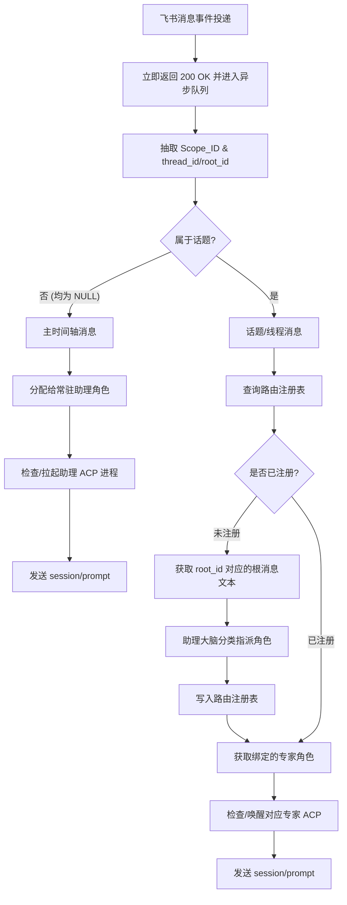

# 产品需求文档 (PRD)：个人版 AI Agent 虚拟团队智能网关

## 1. 文档概述

### 1.1 变更记录
- **v0.2 (2026-05-16)**: 
    - 完善路由识别逻辑：引入 `root_id` 作为 `thread_id` 的补充，兼容 P2P 回复串。
    - 修正资源下载接口：明确使用 `message-resource` 接口。
    - 增加异步交互规范：引入先响应 `200 OK` 再异步处理的机制。
- **v0.1 (2026-05-16)**: 初始版本。

### 1.2 背景与痛点
当前多智能体（Multi-Agent）协作普遍面临两个痛点：要么前端需要部署一堆机器人导致 UI 极其混乱；要么在单聊中所有角色共享上下文导致严重的逻辑污染，且后台 Agent 进程常驻耗费巨额的内存与 Token 资源。

### 1.3 产品定位
本产品是一个轻量级、拟人化、低资源消耗的个人虚拟团队后端网关。用户在前端（飞书/Lark）只需面对 1 个机器人，即可通过飞书天然的“回复（Thread）”机制，在不同的话题空间无缝调度不同的后台 Gemini 专家智能体。

---

## 2. 核心功能与业务逻辑

### 2.1 空间与话题大一统模型 (Scope-Topic Model)
系统放弃对“群聊”和“单聊”的特殊硬编码，统一抽象为 Scope（空间域）。
- **群聊场景**：Scope_ID = 飞书 chat_id（群 ID）。
- **1v1 单聊场景**：Scope_ID = 飞书 chat_id（单聊会话 ID）。

在任何 Scope 内，通过识别消息的上下文属性区分主时间轴与话题：
- **话题判定规则**：
    1. 若 `thread_id` 不为空，判定为话题。
    2. 若 `thread_id` 为空但 `root_id` 不为空，判定为回复串话题。
    3. 若两者均为空，判定为主时间轴（由常驻助理响应）。

### 2.2 核心业务流程图


---

## 3. 功能需求明细 (Functional Requirements)

### 3.1 消息流智能路由模块 (Routing Module)
- **FR-1.1 空间识别**：系统必须采用飞书 **WebSocket (长连接)** 模式订阅飞书 `im.message.receive_v1` 事件。严禁暴露公网 Webhook 端口，确保内网安全性。系统需准确提取 `chat_id` 作为 `Scope_ID`。
- **FR-1.2 动态角色委派**：当遇到全新的话题（首次出现 `root_id`）时，网关必须异步调用飞书 API 获取根消息文本，并将其送入助理角色的“意图分类大脑”，自动判定该话题属于哪个专家角色，完成绑定。

### 3.2 进程与资源管理模块 (Process & Lifecycle Module)
- **FR-2.1 助理常驻策略**：每个活动 Scope 的“常驻助理”进程采用长 TTL（默认 60 分钟）。
- **FR-2.2 专家惰性退出 (TTL)**：专家进程设置 TTL = 10 分钟。超时无新消息则发送 `session/save` 并强制 kill 进程。
- **FR-2.3 快速唤醒机制**：休眠话题收到新消息时，网关必须在 2 秒内完成进程唤醒、`initialize` 握手及 `session/load` 加载。
- **FR-2.4 响应兜底**：由于 Gemini 处理可能较慢，后端在接收飞书事件后必须**立即返回 200 OK**，防止飞书触发重试机制。

### 3.3 拟人化交互与多模态模块 (UX & Multimodal Module)
- **FR-3.1 日志全拦截**：全量拦截并过滤 gemini cli 的 JSON-RPC 过程日志，仅转发 AI 生成的纯文本回答。
- **FR-3.2 多模态承接**：若消息包含 `image_key` 或 `file_key`，网关必须调用飞书 **`message-resource` 专用接口** 下载资源至本地 `/tmp`，并转化为绝对路径送入 Gemini 进程。
- **FR-3.3 长回复自动文档化**：回复超过 150 字时，调用 Docx API 将 Markdown 转换为文档块并存储，回复用户文档链接及摘要。

---

## 4. 关键交互体感设计 (UX Design)
为了在前端保持完美的拟人化团队体验，系统需要根据空间类型差异化输出引导话术：
### 4.1 群聊空间交互示范
```
用户（在群主轴直接输入）： “帮我写一个 Python 爬虫，抓取目标网站。”
系统（常驻助理直接回复该消息）：
“收到，这个任务已经指派给我们的【开发专家】。请点击本条消息的**‘回复’**进入右侧专用通道与他沟通。”
用户（点击回复，在右侧侧边栏输入）： “好的，开始吧。”
系统（开发专家在侧边栏响应）：
“您好，我是开发专家。关于这个爬虫，请问目标网站是否有反爬限制？您可以把网页结构截图发给我。”
```


### 4.2 1v1 单聊空间交互示范
由于 1v1 单聊无右侧弹出侧边栏，为防止用户在主流中迷失，调整引导话术：
```
用户（在单聊中直接输入）： “帮我审查一下这段测试用例。”
系统（常驻助理直接回复该消息）：
“已为您唤醒【测试专家】。后续讨论请务必继续在当前消息的回复串（Thread）中输入，以保持上下文独立。”
```

---

## 5. 非功能功能需求 (Non-Functional Requirements)

### 5.1 安全与高危授权
- **NFR-1.1 卡片化拦截**：高危操作触发时，网关捕获 ACP 请求并发送飞书互动卡片。后端需监听 `card.action.trigger` 回调以接收用户的 [允许] 或 [拒绝] 指令。

---

## 6. 接口与数据流契约 (Data Contract)

### 6.1 本地注册表结构示例 (JSON)
```json
{
  "chat_group_001": {
    "space_type": "group",
    "topics": {
      "om_root_789012": {
        "role": "Developer",
        "session_file": "path/to/file.session",
        "last_active_time": 1778931200
      }
    }
  }
}
```

### 6.2 网关与 Gemini CLI 的 ACP 核心交互时序
1. **启动/唤醒**：Python 拉起子进程 `gemini cli --acp`。
2. **握手**：Python 发送 `initialize` 请求。
3. **恢复状态**：Python 发送 `session/load` 请求。
4. **业务对话**：Python 发送 `session/prompt`。
5. **异步回复**：收到结果后，调用飞书回复 API（带上 `root_id`）将结果推送到话题内。
